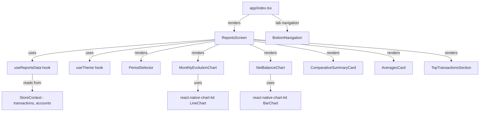

# Design Document: Reports Screen (Relatórios)

## Overview

The Reports Screen provides a retrospective analytical view of the user's finances through charts, comparative summaries, averages, and top transactions. It integrates into the existing tab-based navigation system and follows the established patterns of the Horizonte app (useTheme, useStoreContext, StyleSheet, react-native-chart-kit).

The feature introduces:
- A new `useReportsData` hook that encapsulates all data processing, filtering, and memoization
- A new `ReportsScreen` component rendered via the existing tab system
- Reuse of `react-native-chart-kit` (already in the project) for line and bar charts
- A period selector (3/6/12 months) following the segmented control pattern from `TotaisScreen`

### Key Design Decisions

1. **Single hook for all computations**: All report data is computed in `useReportsData` to centralize filtering rules (paid-only, no transfers) and enable comprehensive testing of pure logic.
2. **Reuse existing charting library**: `react-native-chart-kit` is already a dependency and used in `BalanceChart`. No new charting library needed.
3. **Tab integration via existing pattern**: The screen is added as a new `TabType` value and rendered in the `renderScreen()` switch in `app/index.tsx`, consistent with all other screens.
4. **Pure computation functions**: Core calculations (aggregation, percentage variation, top-N) are extracted as pure functions for testability.

## Architecture



### File Structure

```
components/
  screens/
    ReportsScreen.tsx          # Main screen component
hooks/
  useReportsData.ts            # Data processing hook
constants/
  types.ts                     # Updated TabType
components/
  BottomNavigation.tsx         # Updated with "Relatórios" tab
app/
  index.tsx                    # Updated renderScreen switch
```

## Components and Interfaces

### ReportsScreen Component

```typescript
// components/screens/ReportsScreen.tsx
export function ReportsScreen(): JSX.Element
```

A `ScrollView`-based screen that renders all report sections. Manages the selected period state and passes it to `useReportsData`.

**Responsibilities:**
- Renders `PeriodSelector` (segmented control with 3, 6, 12 month options)
- Renders `MonthlyEvolutionChart` (line chart)
- Renders `NetBalanceChart` (bar chart)
- Renders `ComparativeSummaryCard`
- Renders `AveragesCard`
- Renders `TopTransactionsSection`
- Shows loading skeleton while data processes
- Shows empty state when no transactions exist

### useReportsData Hook

```typescript
// hooks/useReportsData.ts

type PeriodMonths = 3 | 6 | 12

interface MonthlyData {
  month: string        // ISO format "YYYY-MM"
  label: string        // Abbreviated month name (e.g., "Jan", "Fev")
  income: number
  expense: number
  netBalance: number
}

interface ComparativeSummary {
  currentIncome: number
  previousIncome: number
  incomeVariation: number       // percentage
  currentExpense: number
  previousExpense: number
  expenseVariation: number      // percentage
  currentNetBalance: number
  previousNetBalance: number
}

interface Averages {
  avgIncome: number
  avgExpense: number
  avgNetBalance: number
}

interface TopTransaction {
  id: string
  description: string
  amount: number
  date: string
  accountName: string
}

interface ReportsData {
  monthlyData: MonthlyData[]
  comparativeSummary: ComparativeSummary
  averages: Averages
  topExpenses: TopTransaction[]
  topIncomes: TopTransaction[]
  isEmpty: boolean
  isLoading: boolean
}

export function useReportsData(periodMonths: PeriodMonths): ReportsData
```

**Core Filtering Rules (applied universally):**
1. Include only transactions where `paid === true`
2. Exclude transactions where `type === 'transferencia'`
3. Use `transaction.date` to determine competence month

**Internal Pure Functions (exported for testing):**

```typescript
export function filterTransactions(
  transactions: Transaction[],
): Transaction[]
// Applies: paid === true AND type !== 'transferencia'

export function groupByMonth(
  transactions: Transaction[],
): Map<string, Transaction[]>
// Groups by YYYY-MM derived from transaction.date

export function computeMonthlyTotals(
  grouped: Map<string, Transaction[]>,
  periodMonths: PeriodMonths,
): MonthlyData[]
// Computes income/expense/netBalance per month for the selected period

export function computeComparativeSummary(
  monthlyData: MonthlyData[],
): ComparativeSummary
// Compares current month vs previous month

export function computePercentageVariation(
  current: number,
  previous: number,
): number
// Returns ((current - previous) / previous) * 100, or 0 if previous is 0

export function computeAverages(
  monthlyData: MonthlyData[],
): Averages
// Averages the last 3 months of data

export function getTopTransactions(
  transactions: Transaction[],
  type: 'receita' | 'despesa',
  limit: number,
): Transaction[]
// Returns top N transactions of given type sorted by amount descending
```

### Navigation Integration

**TabType update** in `constants/types.ts`:
```typescript
export type TabType = 'saldos' | 'totais' | 'horizonte' | 'contas' | 'menu' | 'cartao' | 'metas' | 'relatorios'
```

**BottomNavigation update**: Add `{ id: 'relatorios', label: 'Relatórios', icon: 'stats-chart-outline' }` to `RIGHT_TABS` (replacing or alongside existing tabs based on space).

**app/index.tsx update**: Add `case 'relatorios': return <ReportsScreen />` to `renderScreen()`.

## Data Models

### Input Data (from StoreContext)

The hook consumes:
- `transactions: Transaction[]` — full transaction list from the store
- `accounts: Account[]` — for resolving account names in top transactions

### Computed Data Flow

```mermaid
flowchart LR
    A[All Transactions] --> B[filterTransactions]
    B --> C[paid=true, no transfers]
    C --> D[groupByMonth]
    D --> E[Map of YYYY-MM → Transaction[]]
    E --> F[computeMonthlyTotals]
    F --> G[MonthlyData[]]
    G --> H[MonthlyEvolutionChart]
    G --> I[NetBalanceChart]
    G --> J[computeComparativeSummary]
    G --> K[computeAverages]
    C --> L[getTopTransactions]
    L --> M[TopTransactionsSection]
```

### Month Label Mapping

```typescript
const MONTH_ABBR = ['Jan', 'Fev', 'Mar', 'Abr', 'Mai', 'Jun', 'Jul', 'Ago', 'Set', 'Out', 'Nov', 'Dez']
```

## Correctness Properties

*A property is a characteristic or behavior that should hold true across all valid executions of a system — essentially, a formal statement about what the system should do. Properties serve as the bridge between human-readable specifications and machine-verifiable correctness guarantees.*

### Property 1: Only paid transactions are included in calculations

*For any* set of transactions with mixed `paid` values, the output of `filterTransactions` SHALL contain only transactions where `paid === true`, and no transaction with `paid === false` shall appear in any computed result.

**Validates: Requirements 3.5, 4.5, 5.6, 6.4, 8.1**

### Property 2: Transfer transactions are excluded from income and expense totals

*For any* set of transactions including transfers (`type === 'transferencia'`), the output of `filterTransactions` SHALL contain no transactions with `type === 'transferencia'`, and no transfer amount shall contribute to any income or expense total.

**Validates: Requirements 3.6, 4.6, 5.7, 6.5, 7.4, 8.2**

### Property 3: Transaction date determines competence month grouping

*For any* transaction with a given `date` field, `groupByMonth` SHALL assign it to the month key `YYYY-MM` derived from that date. A transaction dated "2024-03-15" SHALL always be grouped under "2024-03".

**Validates: Requirements 3.7, 8.3**

### Property 4: Period selection filters to the correct time window

*For any* selected period (3, 6, or 12 months) and any set of transactions, `computeMonthlyTotals` SHALL return data for exactly the number of months equal to the selected period (or fewer if insufficient history exists), and all returned months SHALL fall within the selected time window counting backwards from the current month.

**Validates: Requirements 2.3**

### Property 5: Monthly aggregation correctly sums income and expenses

*For any* set of filtered transactions grouped by month, the `income` field in `MonthlyData` SHALL equal the sum of `amount` for all transactions with `type === 'receita'` in that month, and the `expense` field SHALL equal the sum of `amount` for all transactions with `type === 'despesa'` in that month.

**Validates: Requirements 3.1, 5.1, 5.3**

### Property 6: Net balance equals income minus expenses

*For any* `MonthlyData` entry, `netBalance` SHALL equal `income - expense`. This is an invariant that must hold for every month in the dataset.

**Validates: Requirements 4.1, 5.5**

### Property 7: Percentage variation is correctly computed

*For any* two non-negative values `current` and `previous`, `computePercentageVariation(current, previous)` SHALL return `((current - previous) / previous) * 100` when `previous > 0`, and `0` when `previous === 0`.

**Validates: Requirements 5.2, 5.4**

### Property 8: Averages equal sum of monthly values divided by month count

*For any* sequence of `MonthlyData` entries (up to 3 months), the average income SHALL equal the sum of monthly incomes divided by the number of months, and similarly for expenses and net balance.

**Validates: Requirements 6.1, 6.2, 6.3**

### Property 9: Top-N transactions are the N largest sorted descending

*For any* set of transactions of a given type and a limit N, `getTopTransactions` SHALL return at most N transactions, all of the specified type, sorted by `amount` in descending order, and every returned transaction SHALL have an amount greater than or equal to any excluded transaction of the same type.

**Validates: Requirements 7.1, 7.2**

## Error Handling

| Scenario | Handling |
|----------|----------|
| No transactions exist | Display empty state: "Adicione transações para ver seus relatórios" |
| Fewer months than selected period | Display only available months; charts render with fewer data points |
| Previous month has zero income/expenses | Percentage variation returns 0 (avoid division by zero) |
| Fewer than 5 top transactions | Display only available transactions without error |
| Account not found for top transaction | Display "Conta removida" as fallback account name |
| Store still loading | Display loading skeleton (shimmer placeholders) |

## Testing Strategy

### Property-Based Tests (fast-check)

The project already includes `fast-check` as a dev dependency. Property-based tests will validate the pure computation functions exported from `useReportsData.ts`.

**Configuration:**
- Library: `fast-check` (already installed)
- Minimum iterations: 100 per property
- Test file: `__tests__/useReportsData.test.ts`
- Tag format: `Feature: reports-screen, Property N: <description>`

**Generators needed:**
- `arbitraryTransaction()`: Generates a `Transaction` with random `amount`, `type` (receita/despesa/transferencia), `paid` (true/false), `date` (random date within last 12 months), and valid `accountId`
- `arbitraryTransactionList()`: Array of 0-50 random transactions
- `arbitraryPeriod()`: One of 3, 6, or 12

**Properties to implement:**
1. Only paid transactions pass filter
2. Transfers are excluded by filter
3. Date determines month grouping
4. Period selection limits output months
5. Monthly income/expense sums are correct
6. Net balance invariant (income - expense)
7. Percentage variation formula
8. Averages formula
9. Top-N sorting and limiting

### Unit Tests (Jest)

Example-based tests for:
- Empty state rendering
- Loading skeleton display
- Period selector default value (6 months)
- Chart color logic (green for positive, red for negative net balance)
- Month label abbreviations
- Tab navigation integration
- Tooltip display on chart touch

### Edge Cases (covered by PBT generators)

- All transactions are transfers (results in zero income/expense)
- All transactions are unpaid (results in empty filtered set)
- Single transaction in dataset
- Transactions spanning exactly the period boundary
- Very large amounts (overflow protection)
- Months with zero transactions (should show 0, not be omitted)
