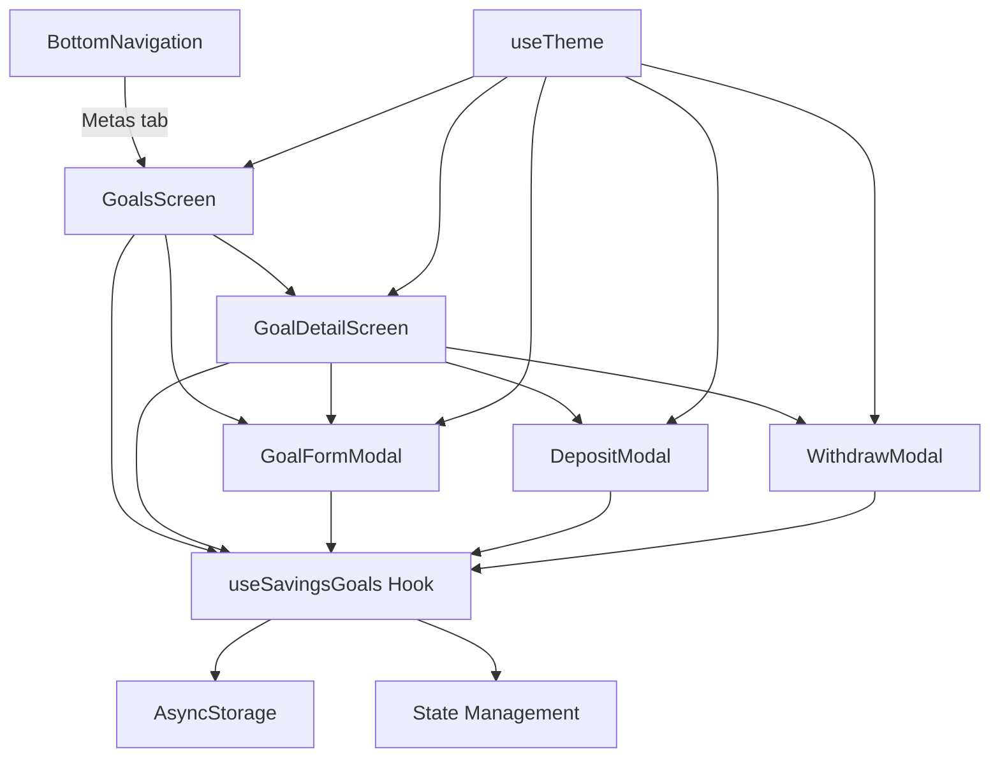

# Design Document: Savings Goals

## Overview

The Savings Goals feature adds a dedicated module to the Horizonte app for creating and managing financial savings goals. Users can define goals with a name, target amount, optional deadline, icon, and color. They can then track progress through deposits and withdrawals, view detailed history, and see visual progress indicators.

The feature integrates into the existing app architecture by:
- Adding a new tab ("Metas") to the BottomNavigation
- Following the same offline-first persistence pattern with AsyncStorage
- Using the existing theme system (dark/light mode) via `useTheme`
- Matching the visual patterns established by SaldosScreen (borderRadius 20, padding 16, gap 16)

The module is self-contained with its own storage key (`@horizonte:savings_goals`), custom hook (`useSavingsGoals`), and screen components, but shares the app's global theme and navigation infrastructure.

## Architecture



The architecture follows the same pattern as the existing `useStore` hook:
- A custom hook (`useSavingsGoals`) encapsulates all state management and persistence logic
- Screen components consume the hook and render UI
- Modals handle user input for create/edit/deposit/withdraw operations
- AsyncStorage provides offline-first persistence with a dedicated key

## Components and Interfaces

### Hook: `useSavingsGoals`

The core data management hook, following the same pattern as `useStore`:

```typescript
// hooks/useSavingsGoals.ts
interface UseSavingsGoalsReturn {
  goals: SavingsGoal[];
  loading: boolean;
  error: string | null;

  createGoal: (input: CreateGoalInput) => Promise<SavingsGoal>;
  updateGoal: (id: string, input: UpdateGoalInput) => Promise<void>;
  deleteGoal: (id: string) => Promise<void>;
  addDeposit: (goalId: string, amount: number) => Promise<void>;
  addWithdrawal: (goalId: string, amount: number) => Promise<void>;
  retry: () => Promise<void>;
}
```

### Screen Components

```typescript
// components/screens/GoalsScreen.tsx
// Main listing screen - accessible via BottomNavigation "Metas" tab
// Displays all goals with progress indicators, empty state, and "Nova Meta" button

// components/screens/GoalDetailScreen.tsx
// Detail view for a single goal
// Shows: name, target, accumulated, remaining, percentage, deadline info, deposit history
// Actions: Depositar, Retirar, Editar, Excluir
```

### Modal Components

```typescript
// components/GoalFormModal.tsx
// Shared form for create and edit operations
// Fields: name, targetAmount, deadline, icon, color
// Props: visible, onClose, onSubmit, initialData? (for edit mode)

// components/GoalDepositModal.tsx
// Numeric input modal for deposits
// Validates: amount > 0, amount <= 999,999,999.99

// components/GoalWithdrawModal.tsx
// Numeric input modal for withdrawals
// Validates: amount > 0, amount <= currentAccumulated
```

### Validation Module

```typescript
// lib/goalValidation.ts
interface ValidationResult {
  valid: boolean;
  errors: Record<string, string>;
}

function validateGoalForm(input: CreateGoalInput): ValidationResult;
function validateDepositAmount(amount: number): ValidationResult;
function validateWithdrawalAmount(amount: number, accumulated: number): ValidationResult;
```

### Utility Functions

```typescript
// lib/goalUtils.ts
function calculateProgress(accumulated: number, target: number): number;
  // Returns floor(accumulated / target * 100), capped at 100

function calculateRemainingDays(deadline: string): number | null;
  // Returns remaining calendar days (inclusive), or null if no deadline

function calculateOverdueDays(deadline: string): number | null;
  // Returns days overdue, or null if not overdue

function calculateRemainingAmount(target: number, accumulated: number): number;
  // Returns max(0, target - accumulated)

function recalculateAccumulated(deposits: GoalDeposit[]): number;
  // Returns sum of all deposit amounts (including negative for withdrawals)
```

## Data Models

```typescript
// constants/types.ts (additions)

export type TabType = 'saldos' | 'totais' | 'horizonte' | 'contas' | 'menu' | 'cartao' | 'metas';

export interface SavingsGoal {
  id: string;                    // Unique identifier (Date.now().toString())
  name: string;                  // 1-50 characters, non-whitespace-only
  targetAmount: number;          // 0.01 - 999,999,999.99
  accumulatedAmount: number;     // Calculated from deposits on load
  deadline: string | null;       // ISO date string or null
  icon: string;                  // Ionicons name, default "flag-outline"
  color: string;                 // Hex color, default theme primary
  createdAt: string;             // ISO date string
  updatedAt: string;             // ISO date string
}

export interface GoalDeposit {
  id: string;                    // Unique identifier
  goalId: string;                // Reference to SavingsGoal.id
  amount: number;                // Positive for deposits, negative for withdrawals
  date: string;                  // ISO date string (system-generated)
}

export interface CreateGoalInput {
  name: string;
  targetAmount: number;
  deadline: string | null;
  icon: string;
  color: string;
}

export interface UpdateGoalInput {
  name: string;
  targetAmount: number;
  deadline: string | null;
  icon: string;
  color: string;
}

// AsyncStorage schema
// Key: "@horizonte:savings_goals"
// Value: JSON.stringify({ goals: SavingsGoal[], deposits: GoalDeposit[] })
```

## Correctness Properties

*A property is a characteristic or behavior that should hold true across all valid executions of a system — essentially, a formal statement about what the system should do. Properties serve as the bridge between human-readable specifications and machine-verifiable correctness guarantees.*

### Property 1: Goal form validation rejects all invalid inputs

*For any* input where the name is empty or whitespace-only, OR the target amount is <= 0 or > 999,999,999.99, OR the deadline is a past date, the validation function SHALL return `valid: false` with appropriate error messages for each invalid field.

**Validates: Requirements 1.3, 1.4, 1.6, 1.8, 4.2**

### Property 2: Persistence round-trip preserves goal data

*For any* valid SavingsGoal and set of GoalDeposit records, serializing to AsyncStorage and then deserializing SHALL produce objects equal to the originals (excluding recalculated accumulatedAmount which is derived from deposits).

**Validates: Requirements 1.2, 1.5, 7.2**

### Property 3: Progress percentage calculation

*For any* accumulated amount >= 0 and target amount > 0, the progress percentage SHALL equal `Math.min(100, Math.floor(accumulated / target * 100))`.

**Validates: Requirements 2.4, 5.1**

### Property 4: Deposit increases accumulated by exact amount

*For any* valid SavingsGoal and any deposit amount between 0.01 and 999,999,999.99, after a successful deposit the goal's accumulatedAmount SHALL equal the previous accumulatedAmount plus the deposit amount, and a new GoalDeposit record SHALL exist with the exact deposit amount and correct goalId.

**Validates: Requirements 3.3, 3.7**

### Property 5: Withdrawal decreases accumulated by exact amount

*For any* valid SavingsGoal with accumulatedAmount > 0 and any withdrawal amount between 0.01 and the current accumulatedAmount, after a successful withdrawal the goal's accumulatedAmount SHALL equal the previous accumulatedAmount minus the withdrawal amount, and a new GoalDeposit record SHALL exist with a negative amount equal to the withdrawal.

**Validates: Requirements 6.3**

### Property 6: Transaction amount validation

*For any* deposit amount <= 0 or > 999,999,999.99, the deposit validation SHALL reject it. *For any* withdrawal amount <= 0 or greater than the current accumulated amount, the withdrawal validation SHALL reject it.

**Validates: Requirements 3.4, 6.2, 6.4**

### Property 7: Accumulated consistency invariant

*For any* SavingsGoal, the accumulatedAmount SHALL always equal the sum of all associated GoalDeposit amounts (where withdrawals are negative amounts). After loading from storage, recalculation from deposits SHALL produce the same accumulated value.

**Validates: Requirements 7.3**

### Property 8: Completed status reflects accumulated vs target

*For any* SavingsGoal, the goal SHALL be marked as completed (showing checkmark) if and only if accumulatedAmount >= targetAmount. A withdrawal that causes accumulatedAmount to drop below targetAmount SHALL remove the completed status.

**Validates: Requirements 2.5, 6.5**

### Property 9: Goals listing maintains sort order

*For any* set of SavingsGoal items, the Goals_Screen SHALL display them sorted by createdAt in descending order (most recent first). Adding or removing goals SHALL preserve this invariant.

**Validates: Requirements 2.1**

### Property 10: Deadline calculations

*For any* SavingsGoal with a deadline set: if the current date is on or before the deadline, remaining days SHALL equal the number of calendar days from today to the deadline (inclusive of deadline day). If the current date is after the deadline and accumulated < target, overdue days SHALL equal the number of calendar days past the deadline.

**Validates: Requirements 5.4, 5.5**

### Property 11: Deletion removes goal and all associated deposits

*For any* SavingsGoal with N associated GoalDeposit records, after confirmed deletion, neither the goal nor any of its deposits SHALL exist in storage. The count of remaining goals SHALL decrease by 1, and no orphaned deposits SHALL remain.

**Validates: Requirements 4.6**

### Property 12: Malformed data resilience

*For any* malformed or unparseable string stored at the savings goals storage key, loading SHALL treat the data as empty (zero goals, zero deposits) without throwing an error, and SHALL not delete the corrupted data from storage.

**Validates: Requirements 7.6**

## Error Handling

### Storage Failures

| Operation | Behavior on Failure |
|-----------|-------------------|
| Create goal | Show error toast, preserve form data, offer retry |
| Edit goal | Show error toast, do NOT update in-memory state |
| Delete goal | Show error toast, do NOT remove from in-memory state |
| Deposit | Show error toast, do NOT update accumulated display |
| Withdrawal | Show error toast, do NOT update accumulated display |
| Load on startup | Show error state with retry button, display no goals |

### Validation Errors

All validation errors are displayed inline below the relevant field. The form/modal remains open with user data preserved. Validation is performed synchronously before any async operation.

### Data Corruption

If stored data cannot be parsed (malformed JSON, missing required fields, wrong types), the system treats storage as empty and logs the corruption event via `console.error`. The corrupted data is NOT deleted from storage to allow potential manual recovery.

### State Consistency

The hook uses a write-lock pattern (same as `useStore`) to serialize async operations and prevent race conditions. On any write failure, in-memory state reverts to the last successfully persisted state.

```typescript
const withWriteLock = useCallback(<T,>(fn: () => Promise<T>): Promise<T> => {
  const currentLock = writeLock.current;
  let resolve: () => void;
  writeLock.current = new Promise<void>((r) => { resolve = r; });
  return currentLock.then(fn).finally(() => resolve!());
}, []);
```

## Testing Strategy

### Property-Based Tests (fast-check)

The project already has `fast-check` installed. Property-based tests will validate the correctness properties defined above.

**Configuration:**
- Library: `fast-check` (already in devDependencies)
- Minimum iterations: 100 per property
- Tag format: `Feature: savings-goals, Property {N}: {title}`

**Target modules for PBT:**
- `lib/goalValidation.ts` — Properties 1, 6
- `lib/goalUtils.ts` — Properties 3, 10
- `hooks/useSavingsGoals.ts` (with mocked AsyncStorage) — Properties 2, 4, 5, 7, 8, 9, 11, 12

### Unit Tests (Jest)

Example-based tests for specific scenarios:
- Empty state rendering (no goals)
- UI interactions (tap goal → detail screen, tap deposit → modal)
- AsyncStorage failure scenarios (mocked)
- Loading state with ActivityIndicator
- Tab presence in BottomNavigation
- Theme integration (dark/light mode colors applied)
- Confirmation dialog for deletion (confirm/cancel flows)

### Integration Tests

- Full create → deposit → view progress flow
- Create → edit → verify changes persisted
- Create → delete → verify removal
- App restart → data loaded correctly
- Concurrent operations (rapid deposits) handled by write lock
