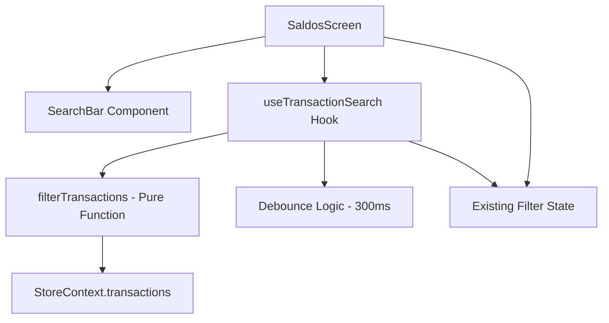

# Design Document: Transaction Search

## Overview

This feature adds a search capability to the existing SaldosScreen, allowing users to find transactions by description or amount across their entire transaction history. The search integrates seamlessly with the existing monthly navigation and filter system, providing an offline-first experience using the in-memory transaction data already loaded from AsyncStorage.

The design prioritizes simplicity: a single search bar with debounced input that filters the existing `transactions` array from the store context. No new data layer or indexing is needed given the target dataset size (up to 5,000 transactions).

## Architecture

The search feature follows the existing component architecture of the app:



**Key architectural decisions:**

1. **Custom hook (`useTransactionSearch`)**: Encapsulates search state, debounce logic, and filtering. Keeps SaldosScreen clean.
2. **Pure filter function (`filterTransactions`)**: Extracted as a standalone pure function for testability. Takes transactions, search term, and filters as input; returns filtered + sorted results.
3. **No new storage layer**: Search operates on the in-memory `transactions` array already provided by `useStoreContext()`. No indexing or caching needed for the target dataset size.
4. **Reuse existing UI patterns**: Search results use the same `renderItem` function and visual layout as the monthly transaction list.

## Components and Interfaces

### SearchBar Component

```typescript
// components/SearchBar.tsx
interface SearchBarProps {
  value: string;
  onChangeText: (text: string) => void;
  onClear: () => void;
  placeholder?: string;
}
```

A controlled text input component with:
- Search icon (Ionicons `search-outline`) on the left
- Clear button (Ionicons `close-circle`) visible when text is non-empty
- Styled to match the app's card-based design system using `colors` from `useTheme()`

### useTransactionSearch Hook

```typescript
// hooks/useTransactionSearch.ts
interface UseTransactionSearchResult {
  searchTerm: string;
  setSearchTerm: (term: string) => void;
  clearSearch: () => void;
  isSearchActive: boolean;
  searchResults: Transaction[];
  displayedResults: Transaction[]; // paginated
  loadMore: () => void;
  hasMore: boolean;
}

function useTransactionSearch(
  transactions: Transaction[],
  filters: { type: TransactionType | 'todas'; accountId: string | 'todas' }
): UseTransactionSearchResult;
```

Responsibilities:
- Manages `searchTerm` state and debounced value (300ms)
- Calls `filterTransactions` with debounced term
- Handles pagination (batches of 20)
- Exposes `isSearchActive` flag for UI mode switching

### filterTransactions (Pure Function)

```typescript
// lib/searchUtils.ts
interface SearchFilters {
  type: TransactionType | 'todas';
  accountId: string | 'todas';
}

function filterTransactions(
  transactions: Transaction[],
  searchTerm: string,
  filters: SearchFilters
): Transaction[];
```

Core search logic:
1. Normalize search term (trim, lowercase)
2. For each transaction, check if:
   - `description.toLowerCase()` contains the normalized term, OR
   - `formatCurrency(amount)` contains the term
3. Apply type and account filters if active
4. Sort results by date descending (most recent first)
5. Return filtered array

## Data Models

No new data models are introduced. The feature operates on the existing `Transaction` interface:

```typescript
interface Transaction {
  id: string;
  description: string;
  amount: number;
  type: TransactionType;
  date: string;
  accountId: string;
  targetAccountId?: string;
  // ... other existing fields
}
```

**Search-relevant fields:**
- `description`: Matched via case-insensitive partial string match
- `amount`: Matched via formatted currency string (`formatCurrency(amount)`)
- `date`: Used for sorting results (descending)
- `type`, `accountId`, `targetAccountId`: Used for filter composition

## Correctness Properties

*A property is a characteristic or behavior that should hold true across all valid executions of a system — essentially, a formal statement about what the system should do. Properties serve as the bridge between human-readable specifications and machine-verifiable correctness guarantees.*

### Property 1: Search match completeness and soundness

*For any* set of transactions and any non-empty search term, the `filterTransactions` function SHALL return exactly those transactions where the description (case-insensitive) contains the search term OR the formatted currency amount contains the search term — no more, no less.

**Validates: Requirements 2.1, 3.1, 3.2, 3.3**

### Property 2: Cross-month search scope

*For any* non-empty search term and any set of transactions spanning multiple months, the `filterTransactions` function SHALL return matching transactions from all months, not limited to any single month.

**Validates: Requirements 2.2**

### Property 3: Results are sorted by date descending

*For any* non-empty search term that produces results, the returned transactions SHALL be sorted such that for every consecutive pair (results[i], results[i+1]), the date of results[i] is greater than or equal to the date of results[i+1].

**Validates: Requirements 4.1**

### Property 4: Pagination invariant

*For any* set of search results with length N > 20, the initial displayed results SHALL contain exactly 20 items, and after each "load more" action, the displayed count SHALL increase by at most 20 until all N results are shown.

**Validates: Requirements 4.4**

### Property 5: Filter composition (search AND filters)

*For any* non-empty search term combined with type and/or account filters, every transaction in the results SHALL satisfy BOTH the search term match (description or amount) AND the active filter criteria (type match and/or account match).

**Validates: Requirements 5.1**

## Error Handling

| Scenario | Handling |
|----------|----------|
| Empty/whitespace-only search term | Treated as inactive search; returns to monthly view |
| No matching transactions | Display empty state: "Nenhuma transação encontrada" |
| Very large dataset (5000+ txs) | Debounce prevents excessive re-renders; pagination limits DOM nodes |
| Special characters in search term | No escaping needed — using `String.includes()`, not regex |
| Transactions with undefined/null description | Guard with `(tx.description \|\| '')` before matching |

## Testing Strategy

### Unit Tests (Example-based)

- SearchBar renders with correct icon and placeholder
- Clear button appears only when text is present
- Clearing search restores monthly view with filters preserved
- Empty state message displayed when no results
- Month navigation hidden during active search
- Debounce delays filtering by 300ms

### Property-Based Tests

**Library:** [fast-check](https://github.com/dubzzz/fast-check) (to be added as dev dependency)

**Configuration:** Minimum 100 iterations per property test.

Each property test references its design document property:

- **Feature: transaction-search, Property 1: Search match completeness and soundness** — Generate random transactions (random descriptions, amounts) and random search terms. Verify the filter returns exactly the correct set.
- **Feature: transaction-search, Property 2: Cross-month search scope** — Generate transactions with dates spread across multiple months. Verify search returns matches from all months.
- **Feature: transaction-search, Property 3: Results are sorted by date descending** — Generate random transactions and search terms. Verify output ordering.
- **Feature: transaction-search, Property 4: Pagination invariant** — Generate result sets of varying sizes. Verify pagination batching behavior.
- **Feature: transaction-search, Property 5: Filter composition** — Generate random transactions, search terms, and filter combinations. Verify all results satisfy both criteria.

### Integration Tests

- Performance: filtering 5,000 transactions completes within 100ms
- Full flow: type in search bar → debounce → results update → clear → monthly view restored
