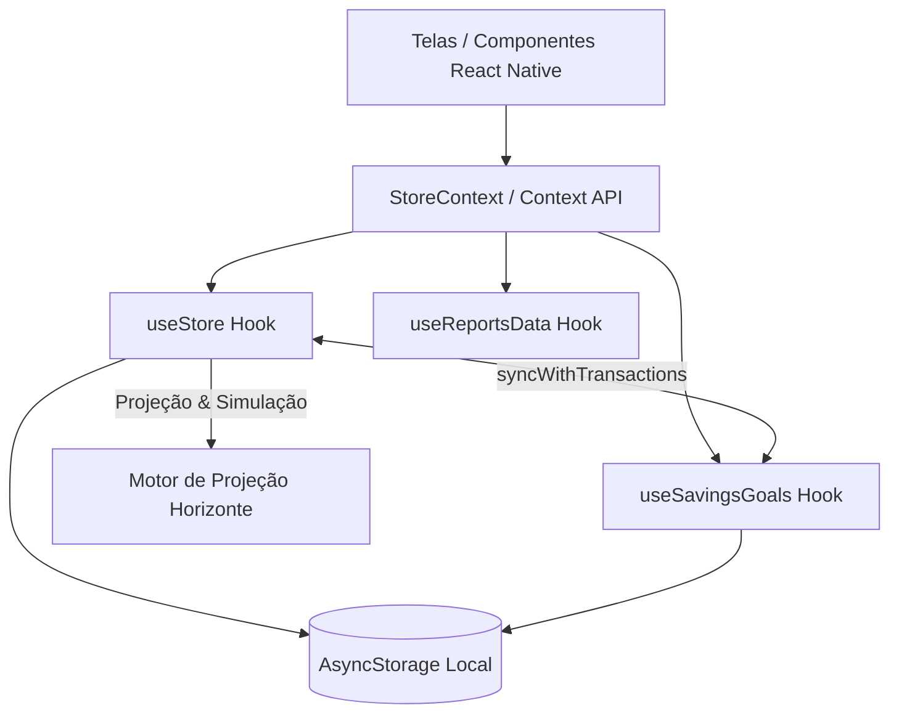

# Arquitetura do Sistema — Horizonte (React Native / Expo)

Este documento descreve a arquitetura técnica, fluxo de dados, gerenciamento de estado e padrões de persistência adotados no **Horizonte**.

---

## 1. Visão Geral da Arquitetura

O Horizonte é um aplicativo de gestão financeira pessoal e projeção de fluxo de caixa desenvolvido em **React Native** com **Expo** (SDK 52), **TypeScript** e arquitetura **Offline-First**.



### Princípios Chave:
- **Offline-First**: Nenhuma dependência de backend externo; toda a verdade reside no `AsyncStorage`.
- **Single Source of Truth (SSOT)**: Transações e contas gerenciadas centralizadamente via `useStore.ts` e expostas por `StoreContext.tsx`.
- **Sincronização Reativa (Write-Lock)**: Operações assíncronas concorrentes de gravação no `AsyncStorage` são serializadas via fila de promises (`withWriteLock`) para evitar condições de corrida (race conditions).

---

## 2. Estrutura de Diretórios

```
horizonte-rn/
├── app/                        # Expo Router (Rotas e Layouts)
│   ├── _layout.tsx             # Root Layout (Theme, GestureHandler, Safe Area, Context Providers)
│   └── index.tsx               # Controladora de navegação de abas e modais globais
├── components/                 # Componentes reutilizáveis e modais
│   ├── AddTransactionModal.tsx # Criação e edição de transações (com seletor de contas/metas)
│   ├── TransactionDetailModal.tsx # Visualização detalhada e ações em lançamentos
│   ├── BottomNavigation.tsx    # Barra de navegação inferior com atalhos dinâmicos
│   ├── ConfirmDeleteModal.tsx  # Diálogo de confirmação para ações destrutivas
│   ├── RecurrenceActionModal.tsx # Seleção de escopo para recorrências (Esta / Futuras / Todas)
│   ├── GoalFormModal.tsx       # Modal de criação/edição de metas financeiras
│   ├── GoalDepositModal.tsx    # Modal de aporte manual em meta
│   ├── GoalWithdrawModal.tsx   # Modal de resgate de meta
│   ├── GoalRecurrenceModal.tsx # Modal de agendamento de aporte mensal recorrente
│   └── screens/                # Telas principais da aplicação
│       ├── SaldosScreen.tsx    # Extrato, saldo consolidado, conciliação e exportação
│       ├── HorizonteScreen.tsx # Motor de projeção diária (30 dias) e controle de meta diária
│       ├── CartaoScreen.tsx    # Gestão de cartões, faturas, compras parceladas e antecipações
│       ├── GoalsScreen.tsx     # Visão geral de metas com ordenação por urgência
│       ├── GoalDetailScreen.tsx# Detalhes da meta, busca e histórico de depósitos/resgates
│       ├── OrcamentoScreen.tsx # Envelopes de orçamento por categoria
│       ├── ReportsScreen.tsx   # Relatórios analíticos e evolução patrimonial
│       ├── ContasScreen.tsx    # Gerenciamento de contas e ajuste auditável de saldos
│       ├── MenuScreen.tsx      # Configurações, temas e resumo financeiro
│       ├── ViagensScreen.tsx   # Planejamento de viagens (módulo em evolução)
│       └── TripDetailScreen.tsx# Detalhes e lançamentos associados à viagem
├── context/                    # Provedores de contexto React
│   ├── StoreContext.tsx        # Contexto global de contas, transações e estado financeiro
│   └── ThemeContext.tsx        # Contexto de tema dinâmico (Claro / Escuro / Sistema)
├── constants/                  # Tipagem TypeScript e definições do sistema
│   ├── types.ts                # Interfaces de domínio (Transaction, Account, SavingsGoal, etc.)
│   └── theme.ts                # Tokens de design e paletas de cores
├── hooks/                      # Hooks customizados para regras de negócio
│   ├── useStore.ts             # Estado de contas, transações, persistência e write-lock
│   ├── useSavingsGoals.ts      # Gestão de metas, depósitos, resgates e sincronização
│   ├── useReportsData.ts       # Agregações e métricas para relatórios
│   ├── useTheme.ts             # Consumo simplificado do tema ativo
│   ├── useTransactionSearch.ts # Mecanismo de busca e filtragem avançada
│   └── useTrips.ts             # Estado e operações do módulo de viagens
└── lib/                        # Utilitários e funções puras de domínio
    ├── utils.ts                # Formatação de moeda, datas e cálculos auxiliares
    ├── goalUtils.ts            # Cálculo de progresso, prazos e status de metas
    ├── goalValidation.ts       # Validações estritas de inputs para metas
    ├── exportUtils.ts          # Exportação de dados para CSV / JSON e compartilhamento
    ├── notifications.ts        # Utilitários para notificações locais (Expo Notifications)
    └── searchUtils.ts          # Normalização e busca de termos
```

---

## 3. Persistência de Dados (Chaves do AsyncStorage)

O aplicativo armazena seu estado localmente utilizando chaves padronizadas com o prefixo `@horizonte:`:

| Chave | Tipo de Dado | Descrição |
|---|---|---|
| `@horizonte:accounts` | `Account[]` | Lista de contas bancárias, cartões de crédito e carteiras |
| `@horizonte:transactions` | `Transaction[]` | Registro mestre de todas as transações financeiras |
| `@horizonte:savings_goals` | `StorageData` | Metas, histórico de depósitos/resgates e recorrências de aportes |
| `@horizonte:active_accounts` | `string[]` (JSON) | IDs das contas selecionadas para projeção no Horizonte |
| `@horizonte:active_goals` | `string[]` (JSON) | IDs das metas incluídas no saldo disponível do Horizonte (ex: Reserva) |
| `@horizonte:view_mode` | `'list' \| 'grid'` | Modo de visualização do planejamento no Horizonte |
| `@horizonte:category_budgets`| `Record<string, number>` | Orçamento mensal alocado por categoria |
| `@horizonte:recurring_overrides` | `Record<string, RecurringExpenseCategory>` | Sobrescritas de categorização de despesas recorrentes |
| `@horizonte:theme_preference` | `'light' \| 'dark' \| 'system'` | Preferência de tema do usuário |

---

## 4. Gerenciamento de Concorrência (Write-Lock Pattern)

Para evitar que operações concorrentes de leitura e escrita no `AsyncStorage` gerem sobrescrita de dados ou estados corrompidos, os hooks principais (`useStore` e `useSavingsGoals`) implementam o padrão de **Write Lock**:

```typescript
// Padrão de fila de execução assíncrona
const writeLock = useRef<Promise<void>>(Promise.resolve());

const withWriteLock = useCallback(<T,>(fn: () => Promise<T>): Promise<T> => {
  const currentLock = writeLock.current;
  let resolve: () => void;
  writeLock.current = new Promise<void>((r) => { resolve = r; });
  return currentLock.then(fn).finally(() => resolve!());
}, []);
```

Toda mutação que altera `accounts`, `transactions` ou `savings_goals` deve ser executada obrigatoriamente envelopada por `withWriteLock`.

---

## 5. Sincronização entre Transações e Metas (`syncWithTransactions`)

A integração entre o fluxo de transações bancárias e as metas de economia é orientada a eventos através do hook `useSavingsGoals`:

1. **Aporte Manual / Recorrente**: Ao registrar uma transferência onde `targetAccountId = 'goal_<goalId>'`:
   - Uma transação do tipo `transferencia` é adicionada ao `useStore`.
   - O `syncWithTransactions` captura a transação paga e cria deterministicamente um `GoalDeposit` com ID `tx_<txId>`.
   - O saldo acumulado da meta é recalculado automaticamente.

2. **Resgate**: Ao registrar uma transferência de `accountId = 'goal_<goalId>'` para uma conta bancária:
   - Uma transação do tipo `transferencia` é registrada.
   - O `syncWithTransactions` gera um `GoalDeposit` com valor negativo e ID `tx_withdraw_<txId>`.
   - O saldo da meta é reduzido e o saldo da conta de destino é creditado.

3. **Exclusão Segura**: Ao apagar um depósito no `GoalDetailScreen`, o sistema desfaz a transação no `StoreContext` pelo ID determinístico, evitando exclusões acidentais por busca aproximada.

---

## 6. Ciclo de Vida e Fechamento de Cartões de Crédito

As transações de cartão de crédito não abatem o saldo bancário de forma imediata. Elas participam do ciclo financeiro do cartão:

- Cada cartão possui `closingDay` (dia de fechamento) e `dueDay` (dia de vencimento).
- Compras realizadas após o dia de fechamento são alocadas na fatura do mês seguinte.
- Compras parceladas geram registros com `installmentNumber` e `totalInstallments`.
- Ao pagar a fatura via `payCreditCardInvoice`, as transações da fatura são marcadas como `paid: true` e uma transação de débito "Pagamento Fatura - [Nome do Cartão]" é gerada para abater a conta corrente de origem.
- O motor do `SaldosScreen` e `ReportsScreen` aplica filtros anti-bitributação para que o pagamento da fatura não duplique despesas já contabilizadas individualmente.
